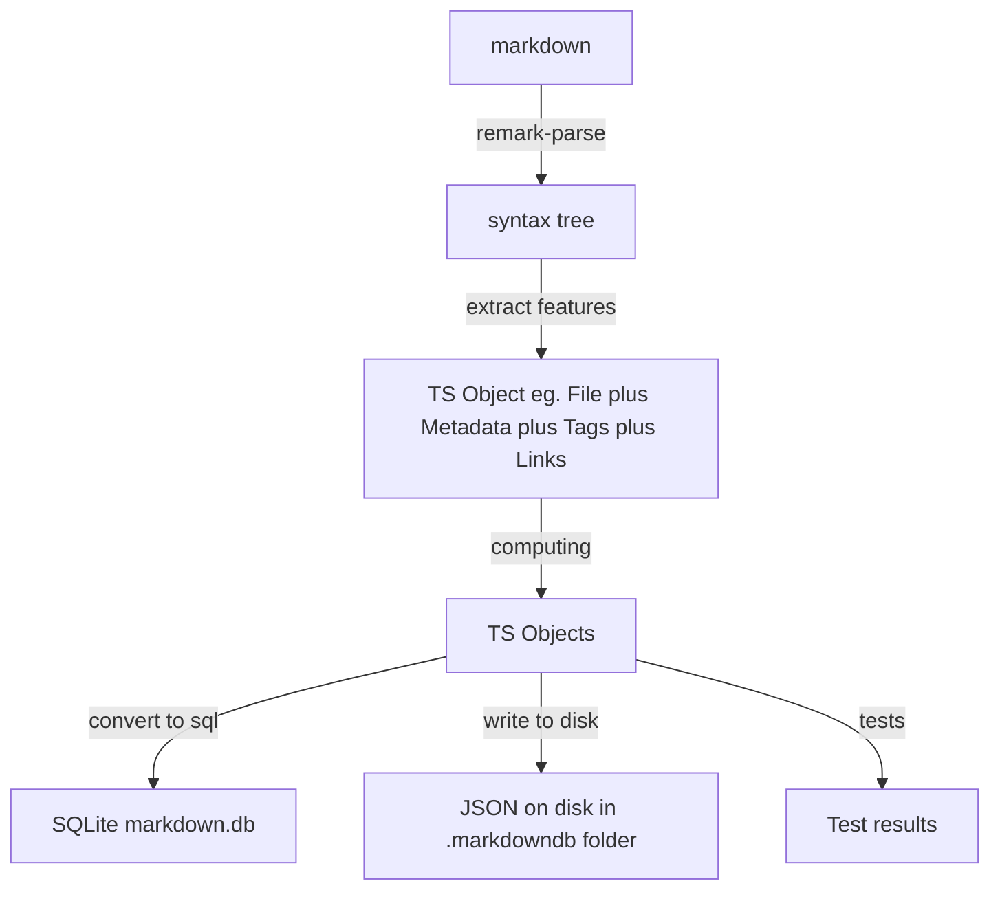

# MarkdownDB

[](https://www.npmjs.com/package/mddb)
[](https://discord.gg/EeyfGrGu4U)

MarkdownDB is a javascript library that turns markdown files into structured queryable data. Build rich markdown-powered sites easily and reliably. Specifically it:

- Parses your markdown files to extract structured data (frontmatter, tags etc) and builds a queryable index either in JSON files or a local SQLite database
- Provides a lightweight javascript API for querying the index and using the data files into your application

## Features and Roadmap

- [x] **Index a folder of files** - create a db index given a folder of markdown and other files
  - [x] **Command line tool for indexing**: Create a markdowndb (index) on the command line **v0.1**
  - [x] SQL(ite) index **v0.2**
  - [x] JSON index **v0.6**
  - [ ] BONUS Index multiple folders (with support for configuring e.g. prefixing in some way e.g. i have all my blog files in this separate folder over here)
  - [x] Configuration for Including/Excluding Files in the folder

Extract structured data like:

- [x] **Frontmatter metadata**: Extract markdown frontmatter and add in a metadata field
  - [ ] deal with casting types e.g. string, number so that we can query in useful ways e.g. find me all blog posts before date X
- [x] **Tags**: Extracts tags in markdown pages
  - [x] Extract tags in frontmatter **v0.1**
  - [x] Extract tags in body like `#abc` **v0.5**
- [x] **Links**: links between files like `[hello](abc.md)` or wikilink style `[[xyz]]` so we can compute backlinks or deadlinks etc (see #4) **v0.2**
- [x] **Tasks**: extract tasks like this `- [ ] this is a task` (See obsidian data view) **v0.4**

Data enhancement and validation

- [x] **Computed fields**: add new metadata properties based on existing metadata e.g. a slug field computed from title field; or, adding a title based on the first h1 heading in a doc; or, a type field based on the folder of the file (e.g. these are blog posts). cf https://www.contentlayer.dev/docs/reference/source-files/define-document-type#computedfields.
- [ ] 🚧 **Data validation and Document Types**: validate metadata against a schema/type so that I know the data in the database is "valid" #55
  - [ ] BYOT (bring your own types): i want to create my own types ... so that when i get an object out it is cast to the right typescript type

## Quick start

### Have a folder of markdown content

For example, your blog posts. Each file can have a YAML frontmatter header with metadata like title, date, tags, etc.

```md
---
title: My first blog post
date: 2021-01-01
tags: [a, b, c]
author: John Doe
---

# My first blog post

This is my first blog post.
I'm using MarkdownDB to manage my blog posts.
```

### Index the files with MarkdownDB

Use the npm `mddb` package to index Markdown files into an SQLite database. This will create a `markdown.db` file in the current directory. You can preview it with any SQLite viewer, e.g. https://sqlitebrowser.org/.

```bash
# npx mddb <path-to-folder-with-your-md-files>
npx mddb ./blog
```

### Query your files with SQL...

E.g. get all the files with with tag `a`.

```sql
SELECT files.*
FROM files
INNER JOIN file_tags ON files._id = file_tags.file
WHERE file_tags.tag = 'a'
```

### ...or using MarkdownDB Node.js API in a framework of your choice!

Use our Node API to query your data for your blog, wiki, docs, digital garden, or anything you want!

Install `mddb` package in your project:

```bash
npm install mddb
```

Now, once the data is in the database, you can add the following script to your project (e.g. in `/lib` folder). It will allow you to establish a single connection to the database and use it across you app.

```js
// @/lib/mddb.mjs
import { MarkdownDB } from "mddb";

const dbPath = "markdown.db";

const client = new MarkdownDB({
  client: "sqlite3",
  connection: {
    filename: dbPath,
  },
});

const clientPromise = client.init();

export default clientPromise;
```

Now, you can import it across your project to query the database, e.g.:

```js
import clientPromise from "@/lib/mddb";

const mddb = await clientPromise;
const blogs = await mddb.getFiles({
  folder: "blog",
  extensions: ["md", "mdx"],
});
```

# Configuring `markdowndb.config.js`

- Implement computed fields to dynamically calculate values based on specified logic or dependencies.
- Specify the patterns for including or excluding files in MarkdownDB.

## Example Configuration

Here's an example `markdowndb.config.js` with custom configurations:

```javascript
export default {
  customFields: [
    (fileInfo, ast) => {
      // Your custom logic here
    },
  ],
  include: ["docs/**/*.md"], // Include only files matching this pattern
  exclude: ["drafts/**/*.md"], // Exclude those files matching this pattern
};
```

### (Optional) Index your files in a `prebuild` script

```json
{
  "name": "my-mddb-app",
  "scripts": {
    ...
    "mddb": "mddb <path-to-your-content-folder>",
    "prebuild": "npm run mddb"
  },
  ...
}

```

### With Next.js project

For example, in your Next.js project's pages, you could do:

```js
// @/pages/blog/index.js
import React from "react";
import clientPromise from "@/lib/mddb.mjs";

export default function Blog({ blogs }) {
  return (
    <div>
      <h1>Blog</h1>
      <ul>
        {blogs.map((blog) => (
          <li key={blog.id}>
            <a href={blog.url_path}>{blog.title}</a>
          </li>
        ))}
      </ul>
    </div>
  );
}

export const getStaticProps = async () => {
  const mddb = await clientPromise;
  // get all files that are not marked as draft in the frontmatter
  const blogFiles = await mddb.getFiles({
    frontmatter: {
      draft: false,
    },
  });

  const blogsList = blogFiles.map(({ metadata, url_path }) => ({
    ...metadata,
    url_path,
  }));

  return {
    props: {
      blogs: blogsList,
    },
  };
};
```

## API reference

### Queries

**Retrieve a file by URL path:**

```ts
mddb.getFileByUrl("urlPath");
```

Currently used file path -> url resolver function:

```ts
const defaultFilePathToUrl = (filePath: string) => {
  let url = filePath
    .replace(/\.(mdx|md)/, "") // remove file extension
    .replace(/\\/g, "/") // replace windows backslash with forward slash
    .replace(/(\/)?index$/, ""); // remove index at the end for index.md files
  url = url.length > 0 ? url : "/"; // for home page
  return encodeURI(url);
};
```

🚧 The resolver function will be configurable in the future.

**Retrieve a file by it's database ID:**

```ts
mddb.getFileByUrl("fileID");
```

**Get all indexed files**:

```ts
mddb.getFiles();
```

**By file types**:

You can specify `type` of the document in its frontmatter. You can then get all the files of this type, e.g. all `blog` type documents.

```ts
mddb.getFiles({ filetypes: ["blog", "article"] }); // files of either blog or article type
```

**By tags:**

```ts
mddb.getFiles({ tags: ["tag1", "tag2"] }); // files tagged with either tag1 or tag2
```

**By file extensions:**

```ts
mddb.getFiles({ extensions: ["mdx", "md"] }); // all md and mdx files
```

**By frontmatter fields:**

You can query by multiple frontmatter fields at once.

At them moment, only exact matches are supported. However, `false` values do not need to be set explicitly. I.e. if you set `draft: true` on some blog posts and want to get all the posts that are **not drafts**, you don't have to explicitly set `draft: false` on them.

```ts
mddb.getFiles({
  frontmatter: {
    key1: "value1",
    key2: true,
    key3: 123,
    key4: ["a", "b", "c"], // this will match exactly ["a", "b", "c"]
  },
});
```

**By folder:**

Get all files in a subfolder (path relative to your content folder).

```ts
mddb.getFiles({ folder: "path" });
```

**Combined conditions:**

```ts
mddb.getFiles({ tags: ["tag1"], filetypes: ["blog"], extensions: ["md"] });
```

**Retrieve all tags:**

```ts
mddb.getTags();
```

**Get links (forward or backward) related to a file:**

```ts
mddb.getLinks({ fileId: "ID", direction: "forward" });
```

## Architecture


